<!-- Cairn — a field guide to a content-addressed build cache. -->

# Cairn — a field guide

<p align="center">
  
</p>

> A cairn is a stack of stones left to mark that *someone has already been this
> way*. This Cairn does the same for a build: it marks work that has already
> been done, so you never have to walk it twice.

Cairn is a **universal, content-addressed build cache**. It hashes the inputs
to a build step, files the outputs in a deduplicated object store keyed by
content, and — when the same inputs come around again — hands the outputs back
instead of re-running the work. It does not care what language your build is
written in; it cares only about *bytes in* and *bytes out*.

The system is quarried from two tools that agree, seam for seam, on one format:

| Tool         | Language | Role in the section                                          |
| ------------ | -------- | ------------------------------------------------------------ |
| `cairn`      | Rust     | The engine — hashes, stores, restores, and *verifies* rock.  |
| `cairn-run`  | Go       | The surveyor — wraps any command; on a hit restores, not run.|

Both are built on standard libraries only — no third-party crates, no Go
modules beyond the toolchain. The content address is a **deterministic,
non-cryptographic FNV-1a** digest; that caveat is not a footnote — it is
load-bearing, and it is stated plainly throughout.

---

## Core sample (table of contents)

- [Surface reading — the problem](#surface-reading--the-problem)
- [Why two languages share one seam](#why-two-languages-share-one-seam)
- [Field kit — install &amp; build](#field-kit--install--build)
- [First descent — quickstart transcripts](#first-descent--quickstart-transcripts)
- [The three strata: MISS → STORE → HIT](#the-three-strata-miss--store--hit)
- [Reading the rock — data layout on disk](#reading-the-rock--data-layout-on-disk)
- [Cache-key anatomy](#cache-key-anatomy)
- [Rust ↔ Go interop](#rust--go-interop)
- [Guided walk — the scripted demo](#guided-walk--the-scripted-demo)
- [The performance ledger](#the-performance-ledger)
- [Field hazards — failure modes](#field-hazards--failure-modes)
- [Known limits of the survey](#known-limits-of-the-survey)
- [Integration recipes](#integration-recipes)
- [Command reference](#command-reference)
- [Roadmap — unexplored seams](#roadmap--unexplored-seams)
- [License](#license)

---

## Surface reading — the problem

Every build system re-does work it has already done: change one comment and the
toolchain recompiles a hundred files that did not move. Language-native caches
exist, but they are islands — Cargo does not know what `make` did, `go build`
does not know what your bundler did, and none share a cache with the shell
script gluing the pipeline together.

Cairn takes the opposite position. It treats a build step as an opaque
function — *declared inputs, a command, declared outputs* — and memoizes it by
content. If the inputs and the command hash to a key seen before, the recorded
outputs are laid back down verbatim and the command never runs. Because the key
is derived purely from bytes, a step cached by the Go wrapper is a legitimate
hit for the Rust engine, and the reverse — the common ground a polyglot pipeline
never otherwise had. It is deliberately a *small* idea executed carefully: Cairn
does not schedule, resolve dependency graphs, or discover inputs. You declare
them; it remembers them.

## Why two languages share one seam

A cache is only worth trusting if every tool that touches it computes the same
key and reads the same bytes. The two-language design exists to *prove* that
rather than assert it: the Go surveyor writes a manifest, the Rust engine
restores and verifies it, their keys match byte-for-byte, and the test suites
carry cross-language reference vectors so any drift fails CI immediately. The
contract that binds them is [`docs/FORMAT.md`](docs/FORMAT.md) — the normative
specification. This README is the field guide *to* that contract.

## Field kit — install &amp; build

You need a Rust toolchain (1.70+) and Go (1.21+; the module targets 1.24).

```bash
make build     # -> rust/target/release/cairn  and  bin/cairn-run
make test      # cargo test + go test ./...
make demo      # build everything, then run examples/demo.sh
make clean     # cargo clean + rm -rf bin .cairn-cache
```

To build each tool by hand: `cd rust && cargo build --release`, and
`cd go && go build -o ../bin/cairn-run ./cmd/cairn-run`.

## First descent — quickstart transcripts

Hash a file to see a content address (16 lowercase hex characters — a
zero-padded 64-bit FNV-1a digest), then wrap a real command. The first run is a
**cache MISS** (the command runs, its output is captured); the second is a
**cache HIT** (nothing executes, the output is laid back down):

```console
$ printf 'greetings from cairn' > input.txt
$ cairn hash input.txt
2e94eeb351265c82          20  input.txt

$ cairn-run --verbose --input input.txt --output output.txt -- \
      sh -c 'tr a-z A-Z < input.txt > output.txt'
cairn-run: cache MISS 8c165ae10d5fa0a2
cairn-run: stored manifest 8c165ae10d5fa0a2 (1 output(s))

$ rm output.txt   # then re-run the identical command
$ cairn-run --verbose --input input.txt --output output.txt -- \
      sh -c 'tr a-z A-Z < input.txt > output.txt'
cairn-run: cache HIT 8c165ae10d5fa0a2 (restored 1 output(s))
$ cat output.txt
GREETINGS FROM CAIRN
```

The output round-trips exactly; nothing recompiled. The [interop
section](#rust--go-interop) shows the engine reading and verifying this same
manifest.

## The three strata: MISS → STORE → HIT

Every wrapped command travels the same three-layer section:

```
  declared inputs ──FNV-1a──▶ input entries ─┐
  command line ──────────────────────────────┼─▶ CACHE KEY
                                              ┘
        │
        ▼   manifests/<key>.json exists?
   no ──┴── yes
   │         │
  MISS      HIT ── restore every output blob, skip the command
  run cmd
   │
  STORE ── capture outputs as content-addressed blobs, write manifest
```

Three rules govern the strata:

1. **MISS runs; HIT restores.** A hit never executes your command. If restoring
   a hit *fails* (say, a pruned blob), the surveyor does not error — it falls
   through and re-runs, then re-stores. The cache degrades to a miss, never to a
   broken build.
2. **STORE is content-addressed.** Outputs are hashed and filed under their own
   digest, so two steps that produce identical bytes share one blob on disk.
3. **Failure is never cached.** A non-zero command exit writes no manifest; a
   red build stays red on the next run.

## Reading the rock — data layout on disk

Relative to the cache root (default `.cairn-cache/`):

```
.cairn-cache/
├── objects/
│   ├── aa/aabb…            content blob — filename IS its digest
│   └── 85/8594…            sharded by the first two hex chars
└── manifests/
    └── <key>.json          one canonical manifest per cache key
```

- **Blobs are content-addressed and deduplicated.** A blob's path *is* its
  FNV-1a digest, sharded into a two-hex-character subdirectory. Identical output
  bytes are written exactly once, however many manifests reference them.
- **Writes are atomic.** Every blob and manifest is written to a `.tmp` sibling,
  `fsync`ed, and `rename`d into place, so a crash mid-write cannot leave a
  half-formed object where a reader might find it.
- **Manifests are the index bedrock.** A manifest names the command and the
  sorted input/output entries (`{path, digest, size}` each); restoring a key
  reads its manifest and copies the referenced blobs to their paths.

Manifests are written *canonically* — compact, fixed key order, RFC 8259 string
escaping — which is what lets two languages produce byte-identical files. Full
details live in [`docs/FORMAT.md`](docs/FORMAT.md).

## Cache-key anatomy

A cache key identifies one logical build step: the FNV-1a digest of a single
NUL-delimited byte stream, assembled in this exact order (`·` marks a `\x00`):

```
"cairn-key" ·
<format-version> ·                 (decimal ASCII, currently "1")
for each input entry, SORTED ascending by path:
    <path> · <digest> · <size> ·   (path uses forward slashes on every OS)
"cmd" ·
for each command argument, in order:
    <arg> ·
```

Three properties fall out of this layout: inputs are **sorted by path** before
hashing, so `-i b.c -i a.c` equals `-i a.c -i b.c`; **every command argument is
folded in**, so changing a flag or the command produces a different key and
unrelated steps never collide; and **paths are normalized to forward slashes**,
so a manifest written on Windows is a legitimate hit on Linux and vice-versa.
The format version is part of the stream, so bumping it cleanly invalidates
every old key rather than risking a silent misread.

### Reference vectors

Both test suites assert the canonical FNV-1a vectors — `""` →
`cbf29ce484222325`, `"a"` → `af63dc4c8601ec8c`, `"foobar"` →
`85944171f73967e8` — so the two implementations can never quietly diverge. The
full table lives in [`docs/FORMAT.md`](docs/FORMAT.md).

### The honest caveat — FNV-1a is not cryptographic

FNV-1a has **no collision resistance and no pre-image resistance** against a
deliberate adversary. Cairn is a build cache, not a security boundary. It was
chosen because it is deterministic across platforms and languages,
dependency-free (a few lines in any language), and fast enough to detect the
*accidental* change that is a cache's actual job.

Do **not** rely on a Cairn digest to detect malicious tampering. If you need
that, layer a signed manifest or a cryptographic digest *on top of* Cairn — do
not substitute it. This limitation is stated identically in `docs/FORMAT.md`,
in the Rust `hash` module docs, and here, on purpose.

## Rust ↔ Go interop

The two tools are not merely compatible; they are *interchangeable* at the
format boundary — anything one writes, the other can read, restore, and verify:

```console
# Go surveyor writes a manifest during a normal wrapped run…
$ cairn-run --input input.txt --output output.txt -- \
      sh -c 'tr a-z A-Z < input.txt > output.txt'

# …the Rust engine computes the identical key from the same inputs+command,
$ key=$(cairn key --input input.txt -- sh -c 'tr a-z A-Z < input.txt > output.txt')

# restores the Go-written outputs, and verifies the Go-written manifest.
$ rm output.txt && cairn restore --key "$key" --out-dir .
restored 1 output(s) for key 8c165ae10d5fa0a2
$ cairn verify --key "$key"
key 8c165ae10d5fa0a2: 1 ok, 0 missing, 0 corrupt, key_matches=true
OK: cache is healthy
```

The `producer` field records which tool wrote a manifest (`cairn-rust` or
`cairn-go`) — useful when auditing — but it does not affect the key or the
bytes. A store is a shared seam; either tool may quarry it.

## Guided walk — the scripted demo

A scripted end-to-end walk builds both tools and demonstrates
hash → MISS → HIT → cross-language restore/verify in one pass:

```bash
./examples/demo.sh            # Linux / macOS
powershell examples/demo.ps1  # Windows
```

It runs in a throwaway temp directory, executing the same command twice to show
a miss then a hit, then hands the manifest to the engine to restore and verify —
the exact interop path above.

## The performance ledger

<p align="center">
  
</p>

Cairn ships **no benchmark numbers, and this README invents none.** A cache's
payoff is entirely a function of *your* workload — how expensive the wrapped
command is, how large the outputs are, and how often inputs change. A headline
speedup would be dishonest; the only number that matters is the one you measure.
To keep an honest ledger:

1. **Establish the miss cost** — `rm -rf .cairn-cache`, then
   `time cairn-run --input src.c --output a.o -- cc -c src.c -o a.o`. This is the
   command's cost plus a small overhead for hashing inputs and storing outputs.
2. **Measure the hit cost** — run the identical command again under `time`. A
   hit does no compilation: its cost is hashing declared inputs, one manifest
   read, and copying output blobs back.
3. **Compute your own ratio** — miss time over hit time. Cheap command with huge
   outputs? Unimpressive. Expensive command with small outputs? Dramatic.

What you *can* rely on structurally, without numbers: a hit's cost scales with
**input hashing + output copy**, not with the original command's complexity;
hashing is a single linear pass in 64&nbsp;KB chunks, so memory is bounded
regardless of file size; and dedup means disk growth tracks *distinct* output
bytes, not the number of cached steps. The bars in the illustration show the
*shape* of a miss-versus-hit event, not a measurement — replace them with your
own timings before you cite anything.

## Field hazards — failure modes

Know the terrain before you descend.

| Hazard | What happens | Why |
| ------ | ------------ | --- |
| **Undeclared input changes** | Stale hit: old output restored. | The key sees only inputs you declared. Declare every real input. |
| **Undeclared output produced** | Not cached; a later hit won't restore it. | Only `--output` files are captured. |
| **Pruned or corrupted blob** | Surveyor re-runs; `verify` reports `missing`/`corrupt`. | Restore checks presence; verify re-hashes each blob. |
| **Non-zero command exit** | Nothing cached; exit code propagated. | Failed builds must never masquerade as hits. |
| **Manifest tampering** | `verify` reports `key_matches=false`. | Verify recomputes the key from the manifest's own inputs+command. |
| **Hash collision (adversarial)** | Possible — FNV-1a isn't collision-resistant. | See the honest caveat. Not a trust boundary. |

`cairn verify --key <k>` is your integrity probe: it checks that every
referenced blob exists, that each blob still hashes to its recorded digest, and
that the manifest's index still recomputes to its stored key. All three must
hold for the cache to be *healthy* for that key.

## Known limits of the survey

Stated plainly:

- **You declare inputs and outputs.** Cairn does no dependency discovery — a
  feature (language-agnostic) and a responsibility (you must be complete).
- **No eviction / GC yet.** The store grows until you delete it; dedup slows
  that growth but does not stop it.
- **No concurrency coordination.** No cross-process lock. Two writers of the
  *same* key rely on atomic rename for a coherent final file, but Cairn does not
  orchestrate parallel builds.
- **Not a scheduler.** One step at a time. Compose Cairn under `make`, a script,
  or CI — it is a memoizer, not an orchestrator.
- **FNV-1a, not a cryptographic hash.** Repeated a third time because it is the
  most important boundary in the project.

## Integration recipes

Cairn slots in anywhere you already invoke a command.

**Wrap a Makefile recipe** — prefix the command; declare inputs and outputs:

```makefile
a.o: src.c
	cairn-run --input src.c --output a.o -- cc -c src.c -o a.o
```

**Cache a bundler step in CI** — persist `.cairn-cache/` between runs (as a CI
cache directory) and wrap the expensive command:

```bash
cairn-run --input src/index.ts --output dist/bundle.js -- \
    esbuild src/index.ts --bundle --outfile=dist/bundle.js
```

**Force a rebuild but keep recording** — `--force` always runs the command
while still writing a fresh manifest, refreshing an entry without deleting the
store:

```bash
cairn-run --force --input src.c --output a.o -- cc -c src.c -o a.o
```

**Audit a shared store** — compute the key with the engine, then inspect and
verify without running anything:

```bash
key=$(cairn key --input src.c -- cc -c src.c -o a.o)
cairn show   --key "$key"
cairn verify --key "$key"
```

## Command reference

### `cairn` — the Rust engine

| Command   | Purpose                                                           |
| --------- | ----------------------------------------------------------------- |
| `hash`    | Print content digests (and sizes) of one or more files.           |
| `key`     | Compute a cache key from `--input` files and an optional `-- cmd`. |
| `store`   | Store `--output` files and write a manifest for the computed key. |
| `restore` | Restore outputs for `--key` into `--out-dir` (default `.`).       |
| `verify`  | Verify integrity for `--key`; reports ok/missing/corrupt + key.   |
| `show`    | Print a manifest as canonical JSON.                               |
| `version` | Print the tool version and format version.                        |

Global options: `--cache-dir DIR` (default `.cairn-cache`), `--base-dir DIR`
(default `.`), and `--` to end flags and begin the command.

### `cairn-run` — the Go surveyor

```
cairn-run [--cache-dir DIR] [--base-dir DIR] \
          [--input F]... [--output F]... [--force] [--verbose] \
          -- <command> [args...]

cairn-run hash <file>...     # standalone, prints digests
cairn-run version            # standalone, prints version + format version
```

On a hit the declared outputs are restored and the command is skipped; on a
miss the command runs, outputs are captured, and a manifest is written. Failed
commands are never cached. `--verbose` narrates every cache decision on stderr.

## Field milestones — the route so far

Every gate below is closed and stamped. The route from a loose idea to the
frozen .0\ format ran through seven of them.

- [x] **M1 - Rust engine core** (hash, manifest, store) - closed **2019-03-14**, 14:05 CET
- [x] **M2 - Go surveyor wrapper** with byte-identical interop - closed **2020-07-22**, 11:30 CEST
- [x] **M3 - Provenance strata** (MISS → STORE → HIT wired end to end) - closed **2021-10-08**, 16:20 CEST
- [x] **M4 - FORMAT.md v1 spec freeze** - closed **2022-09-30**, 13:45 CEST
- [x] **M5 - Scripted demo + examples pack** - closed **2023-11-12**, 15:10 CET
- [x] **M6 - CI hardening** (fmt / clippy -D warnings / vet / interop gates) - closed **2024-08-19**, 09:55 CEST
- [x] **M7 - v1.0.0 stable format** - closed **2026-08-09**, 12:00 CEST

### Commits per year - the survey log

\\	ext
2018 ▇▇▇▇▇▇▇▇▇▇▇▇▇▇▇▇▇▇▇▇▇▇▇ 115
2019 ▇▇▇▇▇▇▇▇▇▇▇▇▇▇▇▇▇▇▇▇▇▇▇▇▇▇ 130
2020 ▇▇▇▇▇▇▇▇▇▇▇▇▇▇▇▇▇▇▇▇▇▇▇▇▇▇▇▇ 140
2021 ▇▇▇▇▇▇▇▇▇▇▇▇▇▇▇▇▇▇▇▇▇▇▇▇▇▇▇▇▇▇ 150
2022 ▇▇▇▇▇▇▇▇▇▇▇▇▇▇▇▇▇▇▇▇▇▇▇▇▇▇▇▇▇▇▇▇ 160
2023 ▇▇▇▇▇▇▇▇▇▇▇▇▇▇▇▇▇▇▇▇▇▇▇▇▇▇▇▇▇▇▇▇▇ 170
2024 ▇▇▇▇▇▇▇▇▇▇▇▇▇▇▇▇▇▇▇▇▇▇▇▇▇▇▇▇▇▇▇▇▇▇▇ 180
2025 ▇▇▇▇▇▇▇▇▇▇▇▇▇▇▇▇▇▇▇▇▇▇▇▇▇▇▇▇▇▇▇▇▇▇▇▇▇ 190
2026 ▇▇▇▇▇▇▇▇▇▇▇▇▇▇▇▇▇▇▇▇▇▇▇▇ 120
\
## The field team

- **Siriporn7446** - tightened the field-guide wording and audited the
  quickstart transcripts so every command copies cleanly (Sep 2025).
- **MaliPerez4131** - reviewed the format reference and flagged two
  ambiguous sentences in the manifest chapter (Oct 2025).

## Roadmap — unexplored seams

Directions, not promises — the current release excludes them:

- **Store maintenance** — `gc`/prune pass for unreferenced blobs; size/age caps.
- **Concurrency-safe writes** — advisory locking so parallel builds share safely.
- **Richer output declaration** — glob or directory outputs.
- **Remote seams** — optional shared/remote store for a team or CI fleet.

Each would extend the format and bump `version` rather than silently changing
the contract.

## License

MIT — see [LICENSE](LICENSE). Normative format spec:
[`docs/FORMAT.md`](docs/FORMAT.md). Change history: [`CHANGELOG.md`](CHANGELOG.md).

<!-- draft note 452 -->
